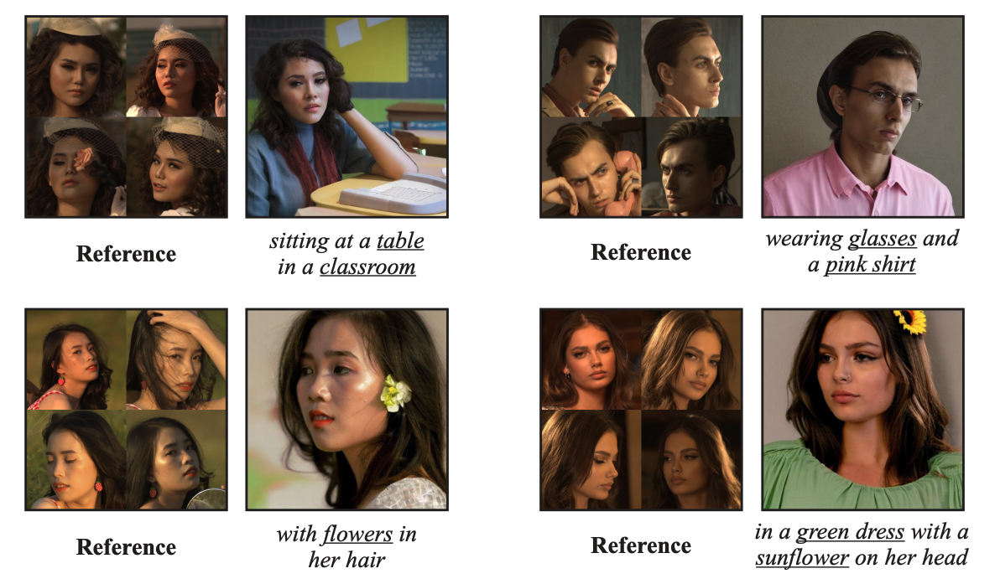

# FeedFace

<p align="center">
   📃 <a href="https://openreview.net/forum?id=PqPKBcamy3" target="_blank">Paper</a> 
</p>

🔥**News!** The paper of ImageReward is accepted by ICLR 2024 tiny papers!

## FeedFace: Efficient Inference-based Face Personalization via Diffusion Models


>In this paper, we introduce FeedFace, a novel inference-based method designed to augment text-to-image diffusion models with face-based conditional generation. Trained on a thoroughly curated and annotated dataset of diverse human faces, FeedFace operates without additional training or fine-tuning for new facial conditions during generation. Our method can create images that are not only true to the textual descriptions but also exhibit remarkable facial faithfulness in seconds. In addition, our model supports using multiple faces as input conditions, leveraging extra facial information to improve the consistency of the generated images. FeedFace is compatible with different architectures, including U-ViT (e.g., UniDiffuser) and U-Net-based (e.g., Stable Diffusion) diffusion models. A key strength of our method lies in its efficiency. Through our experiments, we demonstrate that FeedFace can produce face-conditioned samples with comparable quality to leading industry methods (e.g. Face0), **using only 0.4% of the data volume and fewer than 5% of the training steps required by these methods.**


## Setup
```shell
pip install -r requirements.txt
```

## Usage

### download pretrained models
download pretrained ckpts and necessary autoencoder and caption decoder from [huggingface](https://huggingface.co/Xiang-cd/FeedFace/tree/main), place them in the `models` folder as follows:
```
models
├── autoencoder_kl.pth
├── caption_decoder.pth
├── feed-4800000.pt
├── gpt2
│   ├── config.json
│   ├── generation_config.json
│   ├── merges.txt
│   ├── pytorch_model.bin
│   ├── tokenizer.json
│   └── vocab.json
└── uvit_v1.pth
```

### inference
directly run the inference script:
```shell
python inference.py --prompt "a beautiful smiling woman" --image "path/to/face.jpg" --output "outputs"
```

You could also using a json file as a batch run of inference, using batch of reference images, the `json_examples`dir provide some examples:
```shell
python inference.py -j json_examples/1433.json
```


## Results
Our model could generate face-conditioned samples with high similarity to the input image.

<p align="center">
   
</p>

Our model also retains the textual alignment of the input prompt.

<p align="center">
   
</p>

## Reproduce
To reproduce our work, we provide the following steps:

### Data Preparation
download the FFHQ in the wild images from [here](https://drive.google.com/open?id=1ZX7QOy6LZuTLTnsOtQk-kmKq2-69l5hu).
We provide a list of image that used in our training dataset and caption in `configs/FFHQ_in_the_wild-llava_1_5_13b.jsonl`, the mask shoud be regerated using the `libs/make_data.py` script.
an example of using the script:
```shell
python libs/make_data.py --data_folder data_examples --out_folder data_process
# for multi-gpu processing, could use accelerate library:
CUDA_VISIBLE_DEVICES=0,1,2,3,4,5,6,7 accelerate launch libs/make_data.py --data_folder data_examples --out_folder data_process
```

### Training
modify the `configs/train_config.py` file to set the necessary hyperparameters, the `jsonl_files` should be exisiting and all paths in the jsonl file should be correct.
```python
        jsonl_files=[
            "configs/FFHQ_in_the_wild-llava_1_5_13b.jsonl"
        ],
```
then run the training script:
```shell
accelerate launch --num_processes 8 -mixed_precision fp16 --multi_gpu train.py --config=configs/train_config.py
```

## Limitations
In the context of facial generation, nuanced details such as facial expressions and orientation still pose difficulties, many times resulting in a pasting-like artifact. Moreover, despite the proficiency of our model in producing high-quality and consistent facial images, there are noticeable trade-offs in terms of the semantic alignment with the textual descriptions and overall image quality. Addressing these issues not only underscores the current limitations but also points towards potential avenues for future research.


## Citation
If you make use of our work, please cite our paper:
```
@inproceedings{
xiang2024feedface,
title={FeedFace: Efficient Inference-based Face Personalization via Diffusion Models},
author={Chendong Xiang and Armando Fortes and Khang Hui Chua and Hang Su and Jun Zhu},
booktitle={The Second Tiny Papers Track at ICLR 2024},
year={2024},
url={https://openreview.net/forum?id=PqPKBcamy3}
}
```